# Evaluating large vision-language models on geographic language understanding

This project was developed under the course INFO 698: Capstone

## Team Members

* [Kapil Parab](https://www.linkedin.com/in/kapilparab/)
* [Vera Jackson](https://www.linkedin.com/in/vera-soloview-jackson/)

## Abstract

Our project studies the reasoning ability of vision language models (VLMs) in geographical complex description parsing (GCDP) tasks. The goal of the model is to generate the geometry of locations using the description as input along with the geometrics of the reference locations. For example, the text “TARGET is between the towns of Adrano and S.Maria di Licodia, 32 kilometres (20 mi) northwest of Catania” describes a location that is not explicitly named.

## Dataset

Our dataset consists of 3 components:

| Reference Image | Ground Truth Image | Text Prompt |
| ------------- |:-------------:| -------------|
| |  | TARGET is located in South-Central RED. It is bordered by the states of GREEN to the north-east and north-west, BLUE to the east, and YELLOW to the southwest. MAGENTA is situated north of Morelos. |

#### Obtaining a copy of the dataset:

To obtain a copy of the dataset for your own use, please contact [Dr. Steven Bethard](https://bethard.github.io/).

## Models Tested

| Models  | Repo Link |
| ------------- |:-------------:|
| GLaMM      | [Repo](https://github.com/mbzuai-oryx/groundingLMM) |
| GeoPixel      | [Repo](https://github.com/kapilparab/GeoPixel)     |
| SAM3      | [Repo](https://github.com/kapilparab/sam3-UA)     |
| Molmo      | [Repo](https://github.com/allenai/molmo) |
| Gemini 3.1 (Pro & Thinking)      | N/A     |
| Claude Opus 4.7 | N/A     |
| Claude Sonnet 4.6 | N/A     |

## Execution

#### Results:
To replicate results, please follow testing/fine tuning instructions included in each model's repository.

#### Slurm:

The slurm scripts located in the repository were used to schedule jobs on [University of Arizona's HPC](https://hpcdocs.hpc.arizona.edu/).

## Results

| Text Prompt | [Prompt](docs/prompt/1.txt) | [Prompt](docs/prompt/2.txt) |
| ------------- |:-------------:| :-------------:|
| Input Image | 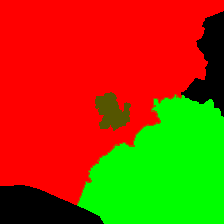 | 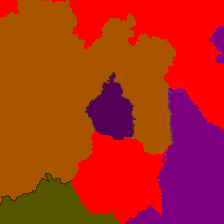 |
| Ground Truth | 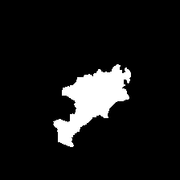 | 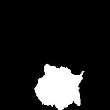 |
| Gemini 3.1 Pro | 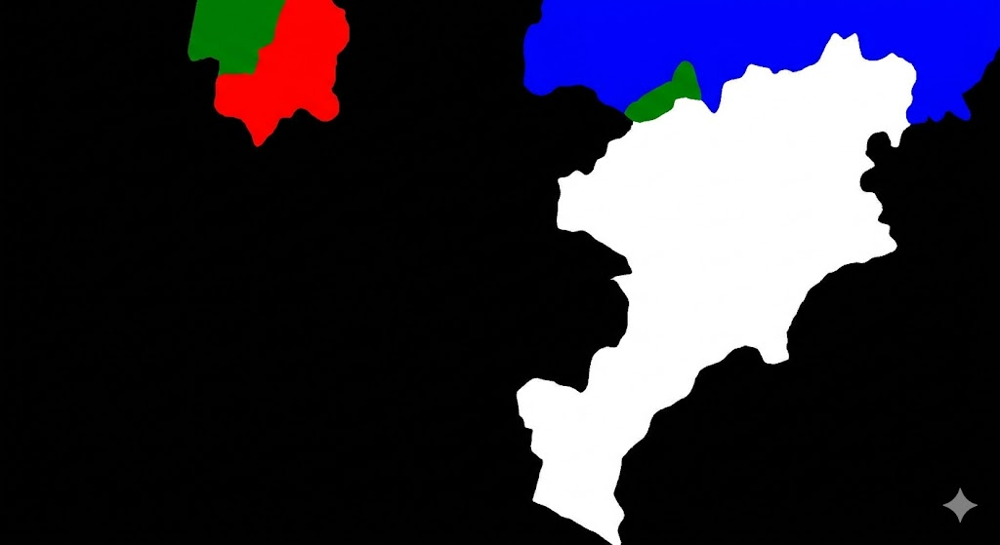 |  |
| Gemini 3.1 Thinking | 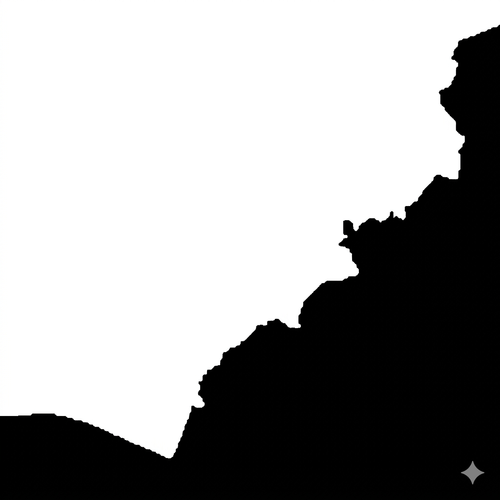 | 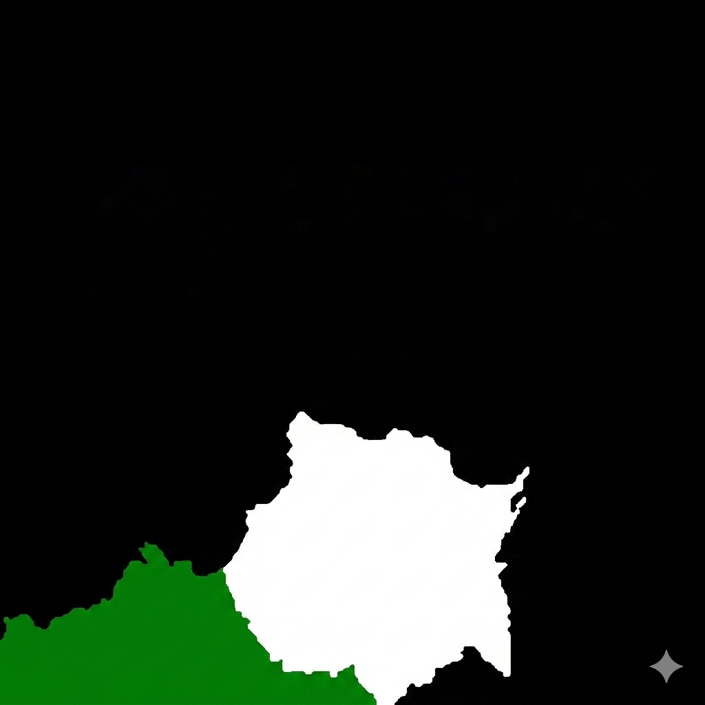 |
| Claude Opus 4.7 |  | 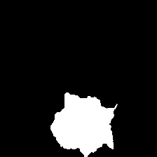 |
| Claude Sonnet 4.6 |  | 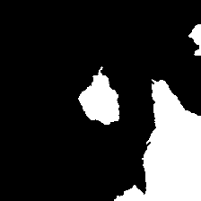 |
| GLaMM | 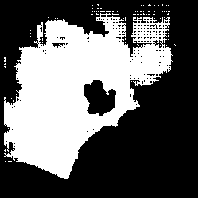 | 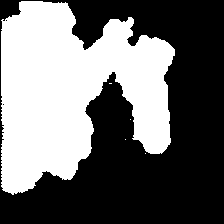 |

## Observations

* While GLaMM can perform segmentation tasks, it struggles with understanding and implementing geographic language and color merging (even when explained in the prompt).

* All models have great segmentation capabilities. They can extract pixel perfect masks using boundaries.

* Out of the box models like Gemini and Claude perform slightly better if the prompt contains hints about the region. For example, the prompt for the image in the 2nd column in the results table above contains the word "Morelos". Gemini and Claude were successful in reasoning where the region is actually located and create the resulting boundaries.

## Future Scope

* Incorporate information about color blending and coordinates as vector embeddings.

* Create a custom model with specific encoder-decoder components similar to GeoPixel and GLaMM.

## References

[1] Wang, R., Laparra, E., & Bethard, S. (2022). Evaluating large vision–language models on geographic language understanding. Submitted to the Fourth International Workshop on Geographic Information Extraction from Texts (GeoExT 2026), ECIR 2026, Delft, The Netherlands.

[2] Laparra, E., & Bethard, S. (2020). A dataset and evaluation framework for complex geographical description parsing. In D. Scott, N. Bel, & C. Zong (Eds.), Proceedings of the 28th International Conference on Computational Linguistics (pp. 936–948). International Committee on Computational Linguistics. https://doi.org/10.18653/v1/2020.coling-main.81 

[3] Application and role of GIS in environmental impact assessment. (2023). Energies, 18(17), 4740. https://www.mdpi.com/1996-1073/18/17/4740

[4] Lai, X., Tian, Z., Chen, Y., Li, Y., Yuan, Y., Liu, S., & Jia, J. (2024). LISA: Reasoning segmentation via large language model. In Proceedings of the IEEE/CVF Conference on Computer Vision and Pattern Recognition (pp. 9579–9589). https://arxiv.org/abs/2308.00692 

[5] Marimo, C., Blumenstiel, B., Nitsche, M., Jakubik, J., & Brunschwiler, T. (2025). Beyond the visible: Multispectral vision–language learning for Earth observation. arXiv. https://arxiv.org/abs/2503.15969 

[6] Waheed, S., Min An, N., Milford, M., Ramchurn, S., & Ehsan, S. (2025). VLM-guided visual place recognition for planet-scale geo-localization. arXiv. https://arxiv.org/abs/2507.17455 
